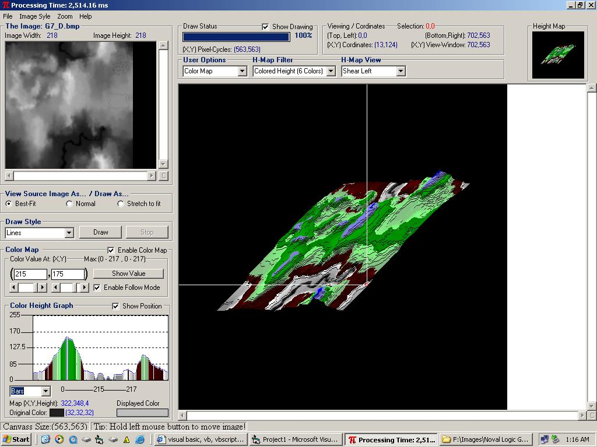



## DDDView HeightMap

### Description

Firstly, I’d like to state that, the idea for this project was inspired by Johannes B, creator of a project that does the same thing(almost). Here’s a link to his. http://www.planetsourcecode.com/vb/scripts/ShowCode.asp?txtCodeId=37204&lngWId=1

I first started out, by adding a little more functionality to his project. Then before I new it, my project started to turn into it’s own thing. Furthermore, there are a few more authors code snippets in this project, although I do not know their names. I’d say 95% percent of this is mine.

This project will create a 3d image from a 2d image. The user can change from many different drawing styles. The user can rotate the image 360 degrees, tilt, and enlarge the image. This project also uses an ini file to remember the last location of a selected image. Any comments both good and bad will be appreciated. Thanks
 
### More Info
 

             |
---                |---
**Submitted On**   |2004-02-19 01:25:34
**By**             |[MJOsborn](https://github.com/Planet-Source-Code/PSCIndex/blob/master/ByAuthor/mjosborn.md)
**Level**          |Intermediate
**User Rating**    |5.0 (50 globes from 10 users)
**Compatibility**  |VB 6\.0
**Category**       |[Graphics](https://github.com/Planet-Source-Code/PSCIndex/blob/master/ByCategory/graphics__1-46.md)
**World**          |[Visual Basic](https://github.com/Planet-Source-Code/PSCIndex/blob/master/ByWorld/visual-basic.md)
**Archive File**   |[DDDView\_He1710682192004\.zip](https://github.com/Planet-Source-Code/mjosborn-dddview-heightmap__1-51864/archive/master.zip)

